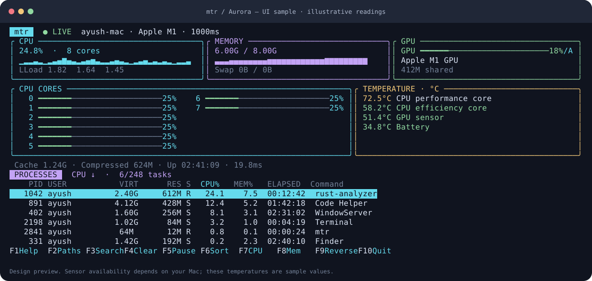

# mtr

A colorful Rust terminal dashboard for CPU, GPU, RAM, temperature, and processes.
Rounded cyan, violet, green, and amber panels group live readings, CPU and memory
history graphs, per-core meters, and the hottest available temperature sensors.
Cache, compressed memory, uptime, filtering, sorting, and keyboard shortcuts stay
close at hand.


Built with [Ratatui](https://ratatui.rs/) and [sysinfo](https://docs.rs/sysinfo/0.33.1/sysinfo/).

**Platform support:** macOS and Linux. Sensor access depends on the hardware,
OS version, and permissions; unavailable readings display `N/A`. Linux and Intel
Mac execution have not been checked locally for this update.

## Run

Install a current stable [Rust toolchain](https://rustup.rs/), then:

```sh
cargo run --release
```

Install the command:

```sh
cargo install --path . --locked
mtr
mtr --interval 500
```

The name `mtr` is also used by a network diagnostic utility. If that is already
installed, run `./target/release/mtr` explicitly or use a shell alias such as
`alias pulse="$PWD/target/release/mtr"` from this project directory.

Cargo installs into `~/.cargo/bin` by default. Rustup configures this on your PATH;
open a fresh Terminal or run `source "$HOME/.cargo/env"` if needed. After
installation, `mtr` runs from any directory. Confirm with `type -a mtr`.

## Share with another Mac (no Rust required)

Build a release archive on your Mac:

```sh
bash scripts/package-macos.sh
```

On Apple Silicon this creates `dist/mtr-0.2.0-macos-arm64.tar.gz` and a SHA-256
checksum file. Share both with a friend using an M-series Mac running macOS 12
or newer. On an Intel Mac the same script makes an Intel archive.

To produce one binary for both Intel and Apple Silicon:

```sh
bash scripts/package-macos.sh --universal
```

The universal option downloads the additional Rust target through rustup, builds
both architectures, and combines them with Apple's `lipo`. It requires Apple's
Command Line Tools (`xcode-select --install` if missing). The resulting archive is
`dist/mtr-0.2.0-macos-universal.tar.gz`. Building both architectures does not replace
testing on both types of Mac.

Your friend extracts the archive, opens Terminal in the extracted folder, and runs:

```sh
bash install.sh
mtr
```

The installer copies the executable to `~/.local/bin`, without requiring Rust or
sudo. If that directory is not on PATH, it prints the exact line to add to
`~/.zshrc`; then open a new Terminal. It refuses to replace an existing `mtr`
unless called with `--force`. To uninstall, remove `~/.local/bin/mtr`.

Archives are locally ad-hoc signed, not Developer ID signed or notarized. macOS
may ask your friend to approve a downloaded executable; follow Apple's
[instructions for software from an unidentified developer](https://support.apple.com/102445)
only for a copy they trust. Do not disable Gatekeeper globally. Public releases
should use Developer ID signing and notarization for a smoother install.

Alternatively, share this entire source folder. A friend with Rust can run
`cargo install --path . --locked` to build for their own machine. A macOS binary
does not run on Linux; Linux needs its own build.

Use a UTF-8 terminal. Standard ANSI colors work in macOS Terminal; true color
is not required. Recommended size: 110 × 32 or larger; minimum: 60 × 16. No root
privileges are needed. On machines with many cores, `[` and `]` page through CPU
meters. JSON includes every core. Narrow terminals hide VIRT and ELAPSED columns.

## Controls

| Key | Action |
| --- | --- |
| `F1`, `?` | Help and metric definitions |
| `F2`, `p` | Toggle executable paths / process names |
| `F3`, `/` | Filter by name, path, username, or PID |
| `F4`, `Esc` | Clear filter |
| `F5`, `Space` | Pause/resume display |
| `F6`, `s`, `Tab` | Cycle sort column |
| `F7`, `c` | Sort CPU |
| `F8`, `m` | Sort displayed memory (macOS footprint; resident elsewhere) |
| `F9`, `r` | Reverse sort |
| `F10`, `q`, `Ctrl+C` | Quit |
| `↑` / `↓`, `j` / `k` | Move selection |
| Mouse wheel / trackpad | Scroll processes inside the dashboard |
| `PgUp` / `PgDn`, `Home` / `End` | Page / first / last |
| `[` / `]` | Previous / next CPU meter page |

On Mac, hold **Fn** if the function keys control brightness or volume. Letter
shortcuts work without Fn. The default view stays at the top of the ranking;
after you navigate, selection follows that process across refreshes. Sorting or
filtering resets selection to the first result.

The process table shows PID, USER, VIRT, MEM (RES on Linux), state, CPU%, MEM%, ELAPSED, and
Command. **ELAPSED is wall time since process start, not accumulated CPU time.**
VIRT includes reserved address space. `R` means runnable; it does not imply the
process is currently executing. CPU meter colors indicate total load, not a
user/kernel breakdown. F-key labels reflect the implemented actions; this is a
monitor, without process termination or priority-changing commands.

## Measurements

* **CPU:** checked native per-core Mach counter deltas on macOS, and sysinfo on
  Linux, with a warm-up interval before the first reading. A failed macOS read
  clears the baseline; the next successful read warms up again. No zero delta
  or failed read is represented as 0% CPU. An actual measured idle interval is
  correctly 0%. Load averages use checked `getloadavg` on macOS. Aggregate and each logical core range from 0–100%. Process CPU
  uses one-core units and can exceed 100% for multithreaded workloads. These are
  interval averages, not instantaneous measurements; tools sampled at different
  times need not match exactly.
* **Memory:** macOS used RAM is `physical total − free − cached files`, where
  cached files are `(external + purgeable) × page size`. Available RAM is free
  plus cached files (reclaimable capacity, not just unused pages). Speculative
  pages are already included in the kernel's free count and are not added again.
  App memory is `(internal − purgeable) × page size`; wired and compressed memory
  use their respective kernel page counts. These three categories do not cover
  all physical memory: JSON `other_bytes` reports the remaining used memory when
  that difference is nonnegative. All page counters share one VM statistics
  sample. Swap comes from `vm.swapusage`. Failed or inconsistent native queries
  are `N/A` / JSON `null`. Linux uses sysinfo's OS accounting.
  App, Wired, Compressed, and Cached details are shown in the UI; JSON also
  preserves file-backed pages separately. K/M/G mean KiB/MiB/GiB (powers of 1024).
* **Processes:** on macOS, checked `proc_pidinfo(PROC_PIDTASKALLINFO)` reads return
  resident and virtual sizes. CPU is the delta of user + system Mach ticks divided
  by elapsed Mach ticks, in one-core units. A new or inaccessible process shows
  CPU `N/A` until two valid samples exist; start time including microseconds guards
  against PID reuse. Failed queries never become zero memory readings.
  macOS `MEM` and memory sorting use `proc_pid_rusage`'s physical footprint, the
  metric used for Activity Monitor's Memory column. A failed footprint read
  stays `N/A`; it never falls back to a different memory metric. JSON
  `memory_footprint` is footprint and `memory` remains resident RAM. Linux uses
  resident RAM (`RES`). Start time is rechecked across the separate footprint
  query to reject PID reuse. Shared resident pages may appear in several processes.
* **macOS cache:** native Mach VM statistics, `external_page_count × page size`
  (file-backed pages). Compressed memory is the physical compressor footprint.
  File-backed pages are not exactly the same as Activity Monitor's Cached Files.
* **Linux cache:** `/proc/meminfo`, `Cached + SReclaimable − Shmem`, saturated at zero.
  Cache overlaps existing memory accounting; do not add it to used RAM.
* **CPU caches:** hardware L1/L2/L3 capacities, read once. These are not cache
  occupancy, misses, or hit rates. macOS uses `sysctl`; Linux reports the cache
  hierarchy for CPU 0. Heterogeneous cores can have different cache sizes.
* **Temperature:** sysinfo hardware components (macOS Apple Silicon HID sensors,
  Intel Mac SMC, or Linux sensors). The panel lists the hottest available sensors
  in Celsius; `--json` includes every detected sensor with its label. GPU driver
  temperatures are included when exposed. Invalid, missing, or zero readings are
  unavailable, never inferred from load. Some Macs/macOS releases expose no
  sensors; the panel then says `N/A · no sensor readings`. No sudo is required.
  Green below 70°C, yellow from 70°C, and red from 90°C are visual guides, not
  hardware-specific thermal limits. Pausing freezes temperatures with the rest
  of the display.
* **GPU:** driver-reported utilization and memory; not an estimate based on CPU
  activity. Missing readings are `N/A` / JSON `null`.

| Platform | GPU source | Notes |
| --- | --- | --- |
| macOS | Native IOKit / IORegistry | Apple GPU activity and shared memory where exposed; no sudo or polling subprocesses |
| Linux AMD | DRM sysfs | Busy percentage, VRAM, temperature when the driver exposes them |
| Linux NVIDIA | `nvidia-smi` | Requires NVIDIA's utility on PATH; 700 ms command timeout |
| Linux Intel | DRM sysfs | Device shown; utilization may be unavailable |

IORegistry performance fields are driver-dependent and may change across macOS
versions. Unified GPU memory is part of system RAM, not extra VRAM. GPU readings
use the driver's own sampling window and may differ from CPU's sampling window.

## Performance and diagnostics

The default interval is 1 second (configurable from 250 ms to 60 seconds). A
background collector publishes only the latest snapshot. The UI polls input at
50 ms and redraws only when data or input changes. History is bounded to 120
samples. Process metadata refreshes each interval; checked native task reads supply
macOS CPU and memory counters. Executable paths and user IDs are fetched once
per process. Hardware and user-name metadata are
collected at startup. NVIDIA collection starts one bounded subprocess per
sample; native macOS and Linux AMD paths do not spawn commands.

```sh
mtr --json                   # one real snapshot, after CPU warm-up
mtr --benchmark 10           # collection latency on your machine
mtr --interval 500 --benchmark 20
cargo test
cargo clippy --all-targets -- -D warnings
cargo fmt
```

JSON and benchmark output report collection wall time; it is not the monitor's CPU overhead.
Measure actual overhead using Activity Monitor or `top` on your machine. No
performance numbers are claimed before benchmarking. JSON is a diagnostic format
and its fields may change before version 1.0.

## Development

`src/metrics.rs` owns sampling and history; `src/platform/` contains platform
collectors; `src/app.rs` handles filtering and sorting; `src/ui.rs` draws the
dashboard. CI checks macOS and Linux builds, tests, and Clippy.

MIT licensed.

### Comparing with Activity Monitor

Compare the same PID, with both apps using a similar refresh interval. mtr defaults
to 1 second; its `--interval` option sets the interval in milliseconds. Activity
Monitor offers update frequencies in its View menu. The programs poll independently,
so changing workloads cannot be guaranteed to produce identical displayed numbers.
No offset, smoothing, or invented value is used to force agreement. Temperature and
GPU readings remain hardware/driver reported; Activity Monitor does not provide a
Celsius sensor reference for validating temperature calibration.

Apple documents the [physical-footprint metric and `proc_pid_rusage`](https://developer.apple.com/videos/play/wwdc2022/10106/)
and [Activity Monitor update frequencies](https://support.apple.com/en-ie/guide/activity-monitor/actmntr2224/mac).
